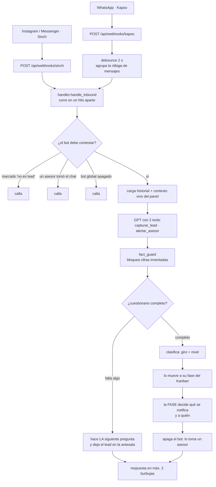
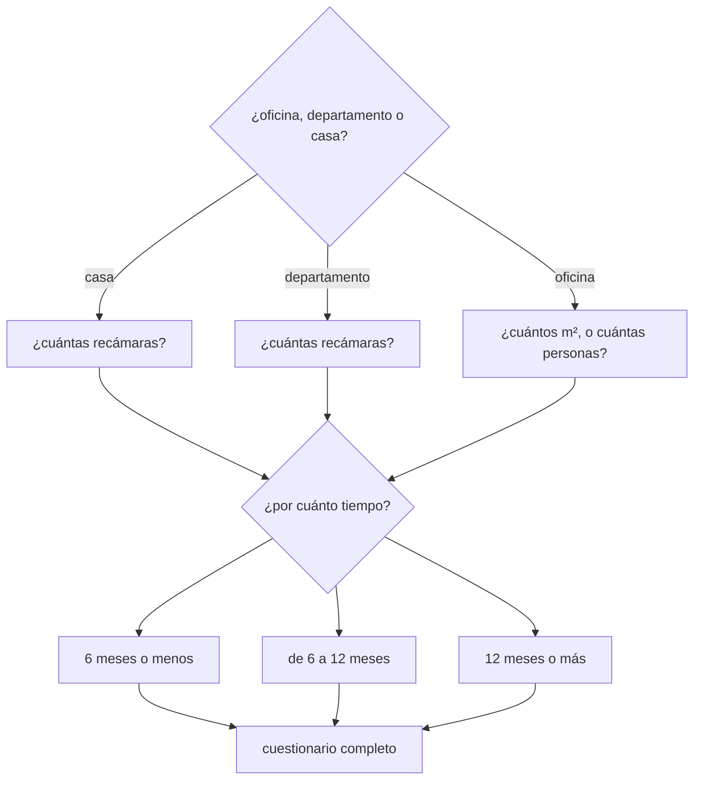
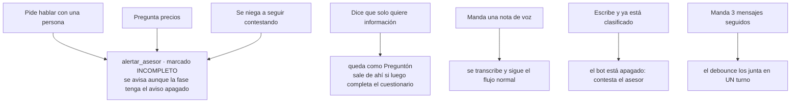

# Flujo del bot — EMA Rentals

> Se ve desde el panel de Vella en **Trabajo → 🔀 Flujos**.
>
> Este archivo vive aquí (no en el panel) para que se actualice en el mismo commit que
> cambia el comportamiento. Si tocas `prompt.py` o `leads.py`, tócalo también.
>
> El detalle de las reglas de clasificación está en [`flow-clasificacion.md`](./flow-clasificacion.md).

EMA Rentals **no agenda, no cotiza y no maneja propiedades**. Filtra leads y avisa a un asesor.

---

## Camino principal

**Regla de oro:** nada se clasifica, se notifica ni apaga el bot hasta que el cuestionario
esté completo. Lo decide `leads.cuestionario_completo()`, que es la única fuente de verdad.

---

## El cuestionario

---

## Qué hace ante cada situación

La excepción de la regla de oro es S1/S2/S3: ahí se avisa **siempre**, marcado como
incompleto y con la lista de lo que faltó. Si no, se apagaría el bot sin que nadie atienda
al prospecto.

---

## Herramientas del bot

| Tool | Cuándo la llama | Qué escribe |
|---|---|---|
| `capturar_lead` | en cuanto sabe algo nuevo | tipo de propiedad, recámaras/m², plazo, nombre |
| `alertar_asesor` | piden humano, piden precio, o se niegan | avisa y apaga el bot, marcado incompleto |

El cierre normal **no** usa `alertar_asesor`: cuando el cuestionario termina, el código lo
detecta solo y la fase decide qué se notifica.
